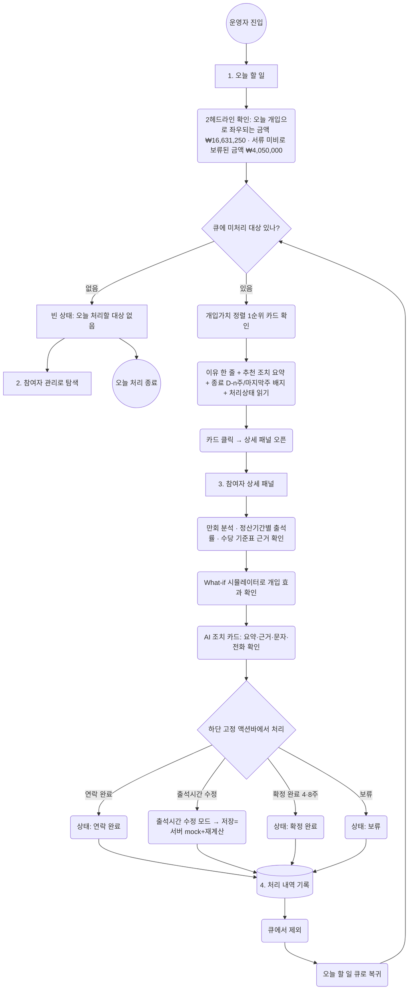
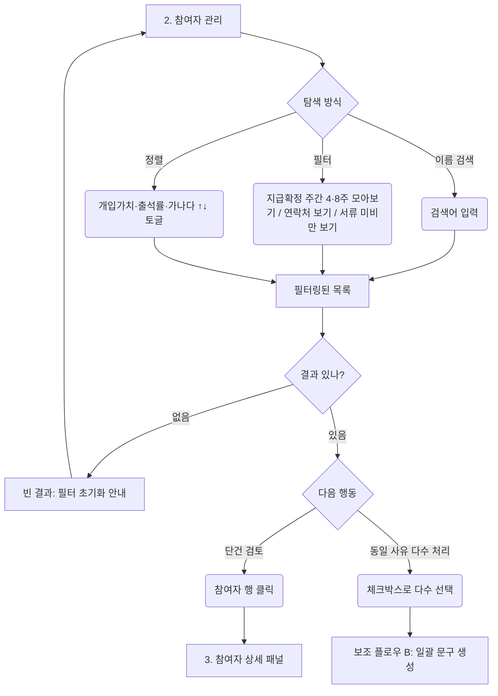
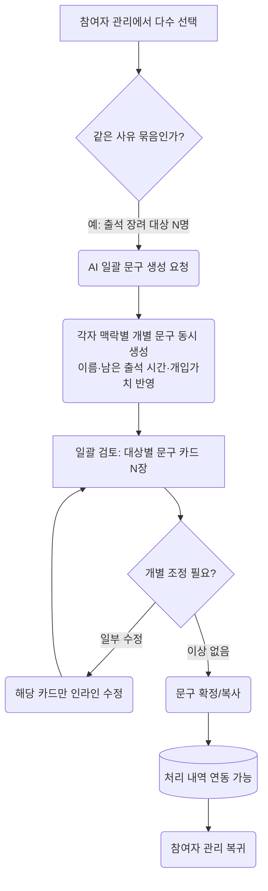
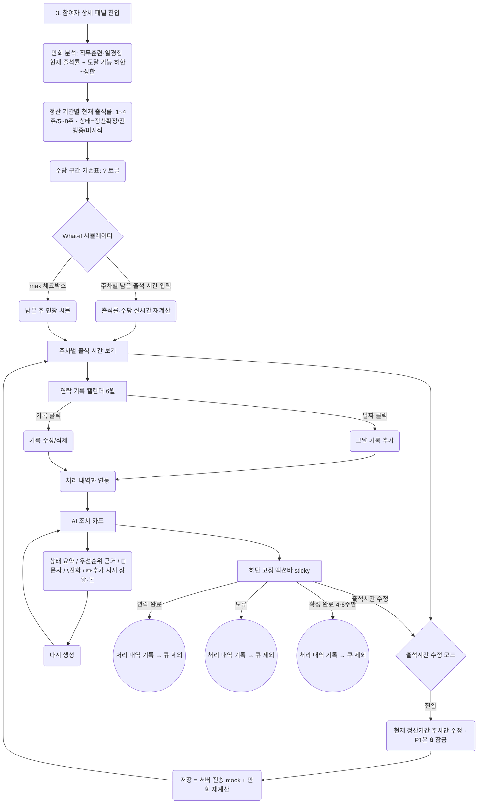
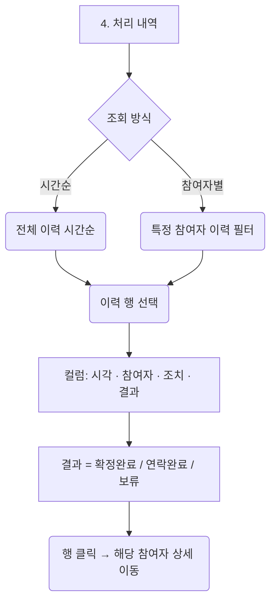

# 유저플로우 — 미래내일 일경험 운영 트리아지 어드민 (과제3)

> 입력: `docs/_MODEL_BRIEF.md` (정합성 기준) + 현재 데모 동선
> 대상: 운영 담당자(Primary) / 멘토(Secondary) · 작성: 2026-06-20

---

## 0. 플로우 범위

| 항목 | 내용 |
|---|---|
| 대상 사용자 | 운영 담당자 (로그인된 단일 운영자 가정, 데모) |
| 시작 상태 | 어드민 진입 (더미 300명 로드 완료 상태) |
| 목표 상태 | 오늘 할 일 큐 상단 대상에 조치를 처리하고 처리 내역에 기록 |
| 핵심 루프 | 오늘 할 일 큐(개입가치 정렬) → 카드 클릭 → 상세 패널 → 처리(하단 고정 액션바) → 처리 내역 기록 → 큐에서 제외 |
| 스케일 루프 | 참여자 관리에서 다수 선택 → AI 일괄 문구 생성 |

> 데모 범위라 인증·회원가입은 mock으로 두고 바로 대시보드로 들어간다. 플로우는 출제 핵심인 두 가지, 즉 개입가치 기반 판단 루프와 일괄 문구로 처리하는 스케일 동선에 집중했다.

4 메뉴는 오늘 할 일, 참여자 관리, 처리 내역, 멘토별 현황으로 구성한다.

---

## 1. 메인 유저플로우 (Happy Path) — 일일 트리아지 루프



상태 확인에서 이유, 개입 효과 시뮬레이션, 처리까지 한 흐름으로 이어진다. 처리 자체는 언제나 운영자가 손으로 하며, AI가 자동으로 확정하거나 문구를 발송하는 일은 없다. 처리를 마치면 그 대상은 큐에서 빠지고 다음 1순위로 자동 이동하고, 모든 조치는 처리 내역에 쌓여 AI 피드백 루프로 돌아간다.

처리 상태는 미처리에서 시작해 연락 완료, 확정 완료(4·8주), 보류 중 하나로 옮겨간다. '처리중'이라는 중간 상태는 두지 않았다.

큐 기본 정렬은 개입가치(swing) 기준으로, 지금 독려하면 더 받을 수 있는 금액을 내림차순으로 보여준다. 정렬키는 개입가치·출석률·가나다를 토글로 바꿀 수 있고 방향도 오름/내림으로 전환된다. 정산기간 종료가 가까운 대상에는 종료 배지(종료 D-n주 / 마지막주)를 달아 4·8주 확정 대상으로 강조한다.

---

## 2. 보조 플로우 A — 참여자 관리 (리스트·검색·필터)



> 이름은 실명이 아니므로 마스킹하지 않는다. 필터는 운영 동선과 바로 맞물린다(4·8주 확정 모아보기, 연락처, 서류 미비만).

---

## 3. 보조 플로우 B — 일괄 문구 생성 (참여자 관리, 스케일 동선)



300명 규모에서 단건을 반복하는 대신 AI가 스케일을 처리한다. 문구는 묶음으로 생성하되 운영자가 한 번에 검토하는 단계를 반드시 거치게 했다(휴먼인더루프). 마음에 안 드는 카드는 개별로 수정할 수 있고, 발송과 확정은 끝까지 사람이 맡는다.

---

## 4. 상세 패널 내부 플로우 (핵심 화면)



계산은 전부 규칙(코드)이 담당한다. 출석률, 수당구간, 금액환산, 개입가치, 만회판정, What-if 재계산이 여기에 해당한다.

출석시간 수정 모드에서는 현재 정산기간 주차만 고칠 수 있고 P1은 잠금 상태다. 수정 중에는 해당 블록만 활성화되며, 저장하면 서버로 전송(mock)하면서 만회 분석을 다시 계산한다.

연락 기록 캘린더는 6월 기준이다. 날짜를 클릭하면 그날 기록을 추가하고, 기존 기록을 클릭하면 수정하거나 삭제한다. 이 입력은 처리 내역과 연동된다.

AI 조치 카드는 요약, 근거, 문자, 전화, 추가 지시(상황·톤)를 담고 필요하면 다시 생성할 수 있다. 다만 AI는 규칙이 만든 숫자와 사실을 표현만 다시 쓸 뿐이라 환각이 끼어들 여지가 없다. 다시 생성은 모드를 골라서 쓰는데, 먼저 로컬 Claude 브리지(키 불필요)를 쓰고, 안 되면 Anthropic API 키를 런타임에 입력하며, 그래도 안 되면 사전 생성한 mock(키·인터넷 불필요)으로 자동 폴백한다.

하단 고정 액션바에는 [연락 완료], [출석시간 수정], [보류]가 놓이고, 현재 주차가 4·8주일 때만 [확정 완료]가 추가된다.

---

## 5. 보조 플로우 C — 처리 내역 (로그)



> 처리 내역은 운영 로그 역할을 한다. 연락 기록 캘린더에서 넣은 기록과 액션바에서 처리한 결과가 함께 쌓인다. 행을 클릭하면 상세 패널로 넘어가 같은 처리 루프를 그대로 쓴다.

---

## 6. 보조 플로우 D — 멘토별 현황 (P2)

```mermaid
flowchart TD
    M0[오늘 할 일/참여자 관리] --> MENTOR(멘토별 현황 진입)
    MENTOR --> MG[프로그램(멘토 그룹) 10개 요약]
    MG --> MSUM(그룹별 출석 장려 대상 · 개입가치 합 요약)
    MSUM --> MPICK{개입 대상 있나?}
    MPICK -->|있음| MHILITE(대상 하이라이트)
    MHILITE --> MSEL(해당 참여자 선택)
    MSEL --> D2[3. 참여자 상세 패널]
    MPICK -->|없음| MOK(이상 없음 표시)
```

> 프로그램 10개(미래내일 일경험_A~E, 직무훈련_A~E)는 코호트마다 현재 주차가 달라 2~8주에 흩어져 있다. 멘토별 현황은 이걸 그룹 단위 개입 우선순위로 요약해 보여준다.

---

## 7. 화면 목록

| # | 화면명 | 설명 | 진입 조건 |
|---|--------|------|---------|
| 1 | 오늘 할 일 | 2헤드라인 + 개입가치 정렬 우선순위 큐(종료 배지·처리상태). 랜딩(승부처) | 진입 시 기본 |
| 2 | 참여자 관리 | 검색·필터(4·8주 모아보기/연락처/서류 미비만)·정렬, 다수 선택 시 일괄 문구 | 상시 |
| 3 | 참여자 상세 패널 | 만회 분석·정산기간별 출석률·수당 기준표·What-if·주차별 출석(+수정 모드)·연락 기록 캘린더·AI 조치 카드 + 하단 고정 액션바 | 큐·리스트·멘토별 현황에서 진입 |
| 4 | 처리 내역 | 처리 이력(시각·참여자·조치·결과) + 행 클릭 시 상세 이동 | 상시(보조) |
| 5 | 멘토별 현황 | 프로그램 10개 그룹 개입 요약 (P2) | 상시(보조) |

---

## 8. 의사결정 매트릭스

| 분기 조건 | 결과 A | 결과 B / C | 처리 방식 |
|---|---|---|---|
| 큐에 미처리 대상 존재 | 1순위 카드 노출 | 빈 상태 → 참여자 관리 탐색 유도 | 개입가치(swing) 내림차순 기본 정렬 |
| 정산기간 종료 임박 | 종료 D-n주 / 마지막주 배지 강조 | 그 외 | 4·8주 확정 주간 모아보기로 분리 |
| 처리 상태 | 미처리 → 연락 완료 / 확정 완료 / 보류 | — | '처리중' 상태 없음 |
| 액션바 처리 | 연락 완료 / 보류 | 확정 완료(4·8주만 노출) / 출석시간 수정 | 처리 내역에 결과 기록, 큐에서 제외 |
| 참여자 관리 다수 선택 | 단건 상세 진입 | 동일 사유 → 일괄 문구 생성 | 같은 사유 묶음 권장, 개별 카드 수정 허용 |
| 필터 결과 | 목록 표시 | 빈 결과 → 필터 초기화 | 필터 AND 조합 |
| 만회 판정(feasib) | 출석 장려 대상 229 | 안전 63 / 만회불가 8 | 처리 대상 232(출석 장려 대상 또는 서류 미비&만회 가능) |
| 멘토별 현황 개입 대상 | 하이라이트 | 이상 없음 | 그룹 내 개입가치 기준 |

---

## 9. 에러 / 예외 / 복귀 처리

| 상황 | 처리 흐름 |
|---|---|
| 빈 큐(처리 대상 0) | "오늘 처리할 대상 없음" 빈 상태 + 참여자 관리 탐색 CTA |
| 필터 결과 0건 | "조건에 맞는 참여자 없음" + 필터 초기화 버튼 |
| 일괄 선택 0건 후 생성 시도 | "대상을 먼저 선택하세요" 안내, 생성 비활성 |
| 일괄 생성 중 일부 실패 | 성공/실패 분리 표시, 실패분만 재생성(자동 mock 폴백) |
| 출석시간 수정 — P1 주차 | 🔒 잠금(현재 정산기간 주차만 수정 가능) |
| 출석시간 저장 | 서버 전송(mock) 후 만회 분석·출석률·수당 재계산 반영 |
| 상세 패널 닫기 | 직전 화면(큐/리스트/멘토별 현황)의 스크롤·필터 상태 유지 |
| AI 다시 생성 실패 | 모드 폴백(로컬 Claude 브리지 → API 키 → mock), 최종 mock 자동 폴백 |
| 데이터 로드 실패(데모) | "데이터 불러오기 실패" + 재시도 (mock) |

---

## 10. 플로우 간 연결

- 오늘 할 일 ↔ 상세 패널: 큐 카드를 클릭하면 상세 패널이 열리고, 액션바로 처리한 뒤에는 처리분을 뺀 채 큐로 돌아온다.
- 참여자 관리 ↔ 상세 패널: 행을 클릭하면 상세로 들어가고, 패널을 닫아도 필터 상태가 그대로 남는다.
- 참여자 관리 → 일괄 문구 → 처리 내역: 다수 선택 후 AI 일괄 문구를 받아 확정·복사하면 처리 내역으로 연동된다.
- 상세 패널 → 처리 내역: 액션바 처리(연락 완료/확정 완료/보류)와 연락 기록 캘린더 입력이 참여자·시각·조치·결과로 append 된다.
- 처리 내역 → 상세 패널: 행을 클릭하면 해당 참여자 상세로 이동한다.
- 멘토별 현황 → 상세 패널: 개입 대상을 고르면 상세로 들어가 같은 처리 루프를 공유한다.

---

## 11. AI 역할 분리

| 주체 | 역할 |
|---|---|
| 규칙(코드) | 출석률·수당구간·금액환산·개입가치(swing)·만회판정(feasib)·What-if 재계산 — 계산은 전부 코드 |
| AI(Claude) | ① 상태 요약 ② 우선순위 근거 ③ 안내 문구 생성(문자·전화, 단건·일괄) ④ 피드백 루프 |
| 사람 | 연락·확정·예외·책임 — 자동 확정/발송 없음 |

> 환각을 막기 위해 규칙이 만든 숫자와 사실을 기준 초안으로 고정해 두고, AI는 표현만 손본다.
> 실서비스에서는 백엔드가 Anthropic Claude API를 호출하고 키는 서버에 둔다. 데모는 로컬 Claude 브리지, API 키 런타임 입력, mock 세 경로로 자동 폴백한다.

---

## 품질 체크리스트

- [x] 4 메뉴(오늘 할 일/참여자 관리/처리 내역/멘토별 현황) 동선 모두 표현
- [x] 핵심 루프: 큐(개입가치) → 카드 → 상세 패널 → 하단 액션바 처리 → 처리 내역 → 큐 제외
- [x] 상세 패널 내부 동선 반영(만회 분석·정산기간별 출석률·수당 기준표·What-if·출석시간 수정 모드·연락 기록 캘린더·AI 조치 카드)
- [x] 처리 상태 머신(미처리 → 연락 완료/확정 완료/보류, '처리중' 없음)
- [x] AI 다시 생성 모드 폴백(로컬 브리지/API 키/mock) 명시
- [x] 과거 표현 제거(위험점수·마스킹 토글·D-day 정산일·확정/반려·처리중·경계선 토글·동반 급락)
- [x] 숫자는 브리프 값만(개입가치 합 ₩16,631,250 · 서류 미비 보류 ₩4,050,000 · feasib 229/63/8 · 처리 대상 232)

---

## 다음 단계

다음은 상세 기능 명세서다. 각 화면과 분기의 기술 명세, API·데이터 계약을 정리한다.
> ※ 본 유저플로우 v2.0은 현재 데모(`_MODEL_BRIEF.md`)와 맞춰 두었다. 4 메뉴, 개입가치 정렬, 상세 패널 동선, 처리 상태 머신, AI 폴백을 반영했다.
